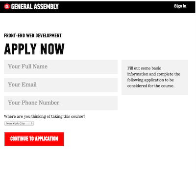

# CSS

## Form Basics

Brian Cama

---

## Learning Objectives

* <!--- .element: class="fragment" data-fragment-index="1" -->Describe how to add a form to a webpage
* <!--- .element: class="fragment" data-fragment-index="2" -->Describe 3 different types of input tags
* <!--- .element: class="fragment" data-fragment-index="3" -->Implement a select field

---

### Relaxr Responsive

How'd it go?

---

##Review

####HTML/CSS/JS

What have we learned so far?

---

## Forms

----

### Forms

How we get data from users



----

### Forms

Wrapper for data collection elements

* <!--- .element: class="fragment" data-fragment-index="1" -->Text Fields
* <!--- .element: class="fragment" data-fragment-index="2" -->Dropdowns
* <!--- .element: class="fragment" data-fragment-index="3" -->Radio Buttons
* <!--- .element: class="fragment" data-fragment-index="4" -->Check Boxes

----

### Forms

Tell the page:

* <!--- .element: class="fragment" data-fragment-index="1" -->**Where** to send the data
* <!--- .element: class="fragment" data-fragment-index="2" -->**How** to send it
* <!--- .element: class="fragment" data-fragment-index="3" -->**What** is being sent

----

### Form Tag


Available Attributes:

* <!--- .element: class="fragment" data-fragment-index="1" -->Action (where):
  * <!--- .element: class="fragment" data-fragment-index="1" -->URL to send data to
* <!--- .element: class="fragment" data-fragment-index="2" -->Method (how):
  * <!--- .element: class="fragment" data-fragment-index="2" -->Post, Get, Put, Delete
* <!--- .element: class="fragment" data-fragment-index="3" -->Enctype (what):
  * <!--- .element: class="fragment" data-fragment-index="3" -->Multipart/form-data if uploading files

----

### Form Tag

<pre><code data-trim class="html">
&lt;form action="register.php" method="post" enctype="multipart/form-data"&gt;
  &lt;!--Data collection elements go here --&gt;
&lt;/form&gt;
</code></pre>

----

### Inputs

Placed between the <code>&lt;form&gt; &lt;/form&gt;</code> tags.

<pre><!--- .element: class="fragment" data-fragment-index="1" --><code data-trim class="html">
&lt;form action="register.php" method="post"&gt;
  &lt;input type="text" /&gt;
&lt;/form&gt;
</code></pre>

----

### Inputs

Attributes:

* <!--- .element: class="fragment" data-fragment-index="1" -->Type
  * <!--- .element: class="fragment" data-fragment-index="1" -->Text, Submit, Password, Email, Checkbox, Button, Radio, File, etc.
* <!--- .element: class="fragment" data-fragment-index="2" -->Name
* <!--- .element: class="fragment" data-fragment-index="3" -->Placeholder
* <!--- .element: class="fragment" data-fragment-index="4" -->Value

----

### Text

<pre><!--- .element: class="fragment" data-fragment-index="1" --><code data-trim class="html">
&lt;form action="register.php" method="post"&gt;
  &lt;input type="text" placeholder="Your Full Name" /&gt;
&lt;/form&gt;
</code></pre>

----

### Text


----

### Email

<pre><!--- .element: class="fragment" data-fragment-index="1" --><code data-trim class="html">
&lt;form action="register.php" method="post"&gt;
  &lt;input type="text" placeholder="Your Full Name" /&gt;
  &lt;input type="email" placeholder="Your Email" /&gt;
&lt;/form&gt;
</code></pre>

----

### Email


----

### Password

<pre><!--- .element: class="fragment" data-fragment-index="1" --><code data-trim class="html">
&lt;form action="register.php" method="post"&gt;
  &lt;input type="text" placeholder="Your Full Name" /&gt;
  &lt;input type="email" placeholder="Your Email" /&gt;
  &lt;input type="password" placeholder="Your Password" /&gt;
&lt;/form&gt;
</code></pre>

----

### Password


----

### Select Fields

<pre><!--- .element: class="fragment" data-fragment-index="1" --><code data-trim class="html">
&lt;form action="register.php" method="post"&gt;
  &lt;select&gt;
    &lt;option value="Seattle"&gt;Seattle&lt;/option&gt;
    &lt;option value="San Francisco"&gt;San Francisco&lt;/option&gt;
  &lt;/select&gt;
&lt;/form&gt;
</code></pre>

----

### File

Adds a button that opens the finder to select a file.

<pre><!--- .element: class="fragment" data-fragment-index="1" --><code data-trim class="html">
&lt;form action="register.php" method="post"&gt;
  &lt;input type="text" placeholder="Your Full Name" /&gt;
  &lt;input type="email" placeholder="Your Email" /&gt;
  &lt;input type="password" placeholder="Your Password" /&gt;
  &lt;input type="file" /&gt;
&lt;/form&gt;
</code></pre>

----

### Submit

Adds a submit button. The value given in the submit will be the button text.

<pre><!--- .element: class="fragment" data-fragment-index="1" --><code data-trim class="html">
&lt;form action="register.php" method="post"&gt;
  &lt;input type="text" placeholder="Your Full Name" /&gt;
  &lt;input type="email" placeholder="Your Email" /&gt;
  &lt;input type="password" placeholder="Your Password" /&gt;
  &lt;input type="file" /&gt;
  &lt;input type="submit" value="Submit" /&gt;
&lt;/form&gt;
</code></pre>

----

##Labels

Information about the input field should be put in a ```<label>``` tag

To tie the two together choose one of these methods:

```<label>Name <input type="text" name="yourName"></label>```

```<label for="yourName">Name</label><input type="text" name=“yourName” id=“yourName”>```

---

## Lab


---

## Closing

----

### Exit Tickets

Give us feedback! Let us know what we're doing well at, and more
importantly, what we can improve at.

----

### Final Project
